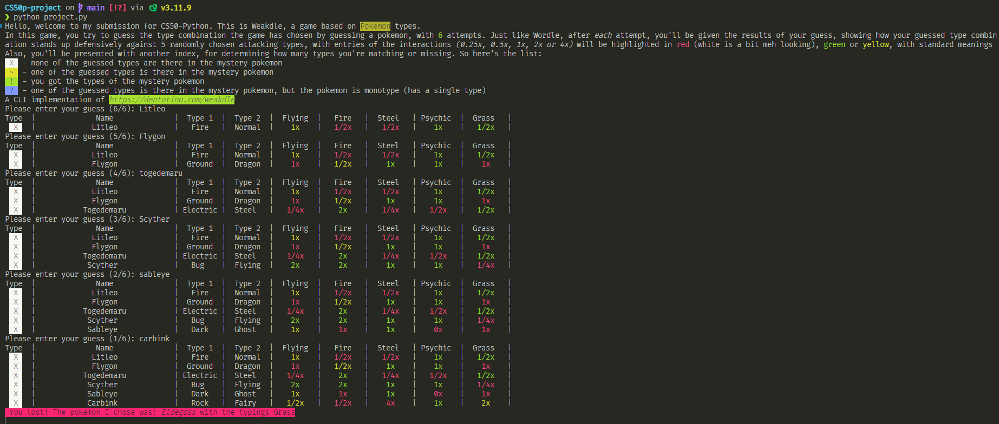

# CS50p-Project

Hello, this is my submission for CS50-Python. This project is an implementation of [Weakdle](https://dentotino.com/weakdle) but for CLI.

### Gameplay
In this game, you try to guess the type combination the game has chosen by guessing a pokemon, with 6 attempts. Just like Wordle, after each attempt, you'll be given the results of your guess, showing how your guessed type combination stands up defensively against 5 randomly chosen attacking types, with entries of the interactions (0.25x, 0.5x, 1x, 2x or 4x) will be highlighted in red (white is a bit meh looking), green or yellow, with standard meanings!  
\
Also, you'll be presented with another index, for determining how many types you're matching or missing. So here's the list:

- `X`  - none of the guessed types are there in the mystery pokemon
- `~`  - one of the guessed types is there in the mystery pokemon
- `!`  - you got the types of the mystery pokemon
- `?`  - you got the types of the mystery pokemon, but they're not in the same order

**Note:** There are ansi colors implemented however it's not possible to demonstrate that in a markdown file, apart from a screenshot, which is attached as follows.  

[]

The demo video is linked [here](https://youtube.com)

### About me:
Hello, I'm Shankha Suvra Dam, an undergraduate student at the Indian Statistical Institute, Bangalore Centre, currently doing a Bachelors in Mathematics (Honours).

### How the project works
The tool first shares the details and instructions about the game, after which, it fetches the list of all pokemons from the [PokeAPI](https://pokeapi.co/), choosing a random one from the list.  

After that, we fetch the types of the mystery pokemon and choose 5 random types out of the 18 existing types to be the attacking types. Then, we finally start a while loop for the game loop, where we ask the user to enter a pokemon name.  

After the user enters the pokemon name, we fetch the types of the entered pokemon and compare them with the types of the mystery pokemon, the user winning if the types are the same.  

We then compare the results of both type combinations with respect to the 5 attacking types, and use a logic similar to the one seen in Wordle of highlighting the results, and also compare the two type combinations to see the status of matching of the types!  

For getting these type interactions, I've created a dict each for resists, immunities and weaknesses for each type, and we get it from that locally.  

And finally, after every guess, we print the table of guesses for the user to keep deducing for their next guess, and when the game ends, we share our guessed pokemon, and their respective types!